# Finance App

## Introduction
The Finance App is a personal finance management tool designed to simplify budgeting, expense tracking, and financial decision-making. Inspired by real-world financial challenges, the app provides users with the tools to understand their spending habits, visualize their financial data, and make informed decisions to achieve financial goals.

---

## Features
### 1. **User Authentication**
- **Registration:** Secure signup with form validation and email verification.
- **Login:** User-friendly login page with encrypted password storage.
- **Password Reset:** Users can reset passwords via a secure email verification process.

### 2. **Dashboard**
- Overview of current budgets, transactions, and financial progress.
- Visualizations of income, expenses, and savings progress.
- Interactive bar graphs for trend analysis.

### 3. **Income and Expense Management**
- Add, edit, and delete income or expense records.
- Visualize income and expenses by category via pie charts.
- Yearly and monthly trend analysis using bar graphs.

### 4. **Budget Planning**
- Create weekly or monthly budgets with progress tracking.
- Avoid overlapping budgets for better organization.
- Separate views for active and expired budgets.

### 5. **Saving Goals**
- Set, track, and manage savings goals with progress rings.
- Add funds to goals dynamically.
- Separate views for active, completed, and incomplete goals.

### 6. **Navigation**
- Intuitive navigation bar with tooltips and a responsive drawer for smaller screens.

---

## Tech Stack
### **Frontend**
- **React**: Interactive, component-based UI design.
- **Material-UI (MUI)**: Pre-styled components for consistent design and data visualization.
- **Redux Toolkit**: State management for consistent data handling.
- **Formik & Yup**: Efficient form handling and validation.

### **Backend**
- **Node.js**: Server-side runtime for asynchronous operations.
- **Express.js**: Framework for routing and middleware integration.
- **Nodemailer**: Email services for password reset and account verification.

### **Database**
- **MongoDB**: NoSQL database for scalable and flexible data management.
- **Mongoose**: ORM for MongoDB to simplify database interactions.
- **Cloudinary**: Secure cloud storage for managing and delivering user profile images.

---

## Installation Guide
1. **Clone the Repository**
   ```bash
   git clone https://github.com/dsaurav4/Finance-App.git
   cd Finance-App
   ```

2. **Install Dependencies**
   - **Server:**
     ```bash
     cd server
     npm install
     ```
   - **Client:**
     ```bash
     cd ../client
     npm install
     ```

3. **Configure Environment Variables**
   - Create a `.env` file in the `server` directory and add:
     ```
     MONGO_URL=<your-mongo-url>
     JWT_SECRET=<your-secret>
     PORT=3001
     CLOUDINARY_CLOUD_NAME=<cloudinary-cloud-name>
     CLOUDINARY_API_KEY=<cloudinary-api-key>
     CLOUDINARY_API_SECRET=<cloudinary-api-secret>
     AUTH_EMAIL=<email>
     AUTH_EMAIL_PASSWORD=<password>
     ```

4. **Start the Application**
   - **Server:**
     ```bash
     cd server
     npm run dev
     ```
   - **Client:**
     ```bash
     cd ../client
     npm run dev
     ```

---

## Code Structure
### **Server**
- `controllers/`: Handles API logic and data processing.
- `routes/`: Defines endpoints for user requests.
- `models/`: Data schemas for MongoDB.
- `middleware/`: Authentication and request processing utilities.

### **Client**
- `src/`: Core components, styles, and logic for the frontend.
- `index.html`: Root entry point for rendering the app.

---

## Challenges
- State management for complex financial data (solved using Redux).
- File uploads for profile pictures (handled via Multer and Cloudinary).
- Ensuring security for sensitive data using JWT and bcrypt.

---

## Future Enhancements
- Advanced analytics and reporting tools.
- Multi-currency support with live exchange rates.
- AI-driven expense categorization and budget recommendations.
- Mobile app development for iOS and Android.
- Integration of investment tracking features.

---

## Screenshots

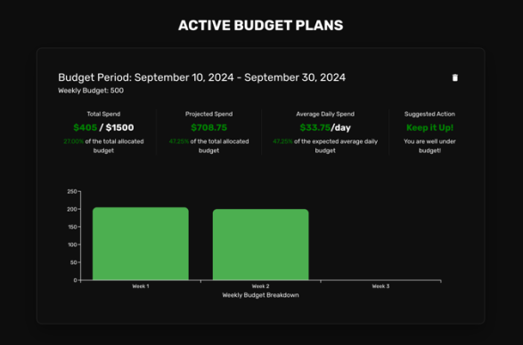
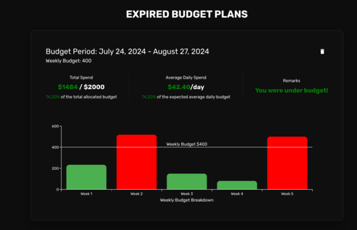
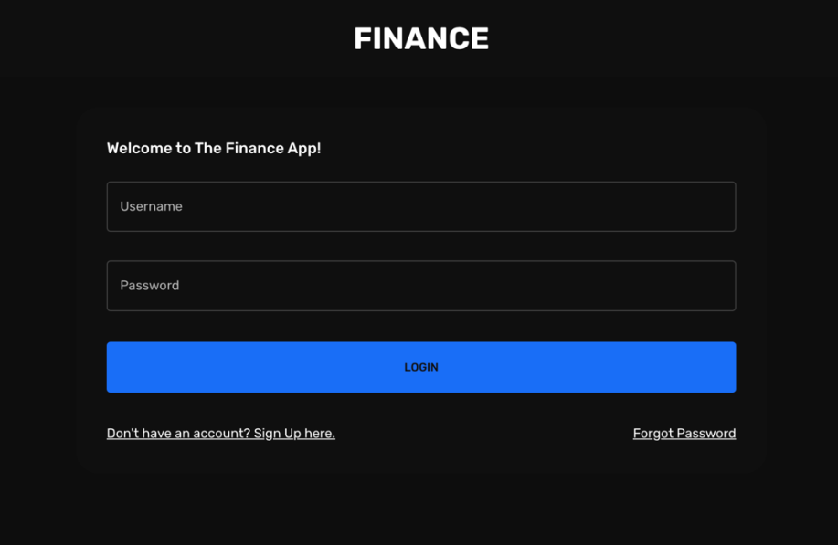

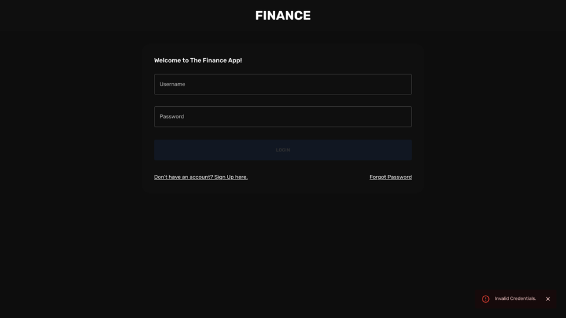
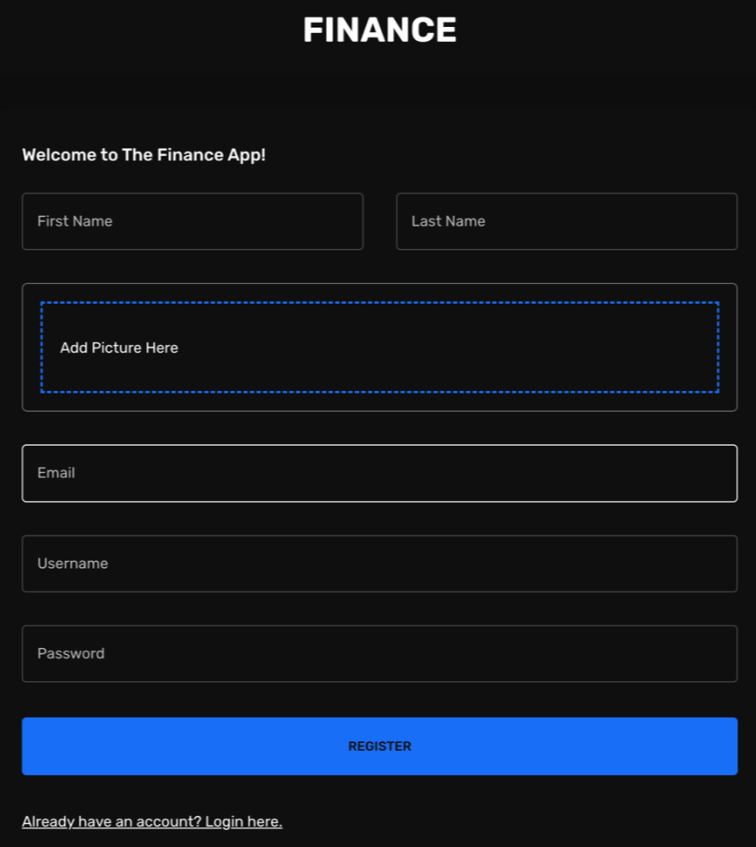
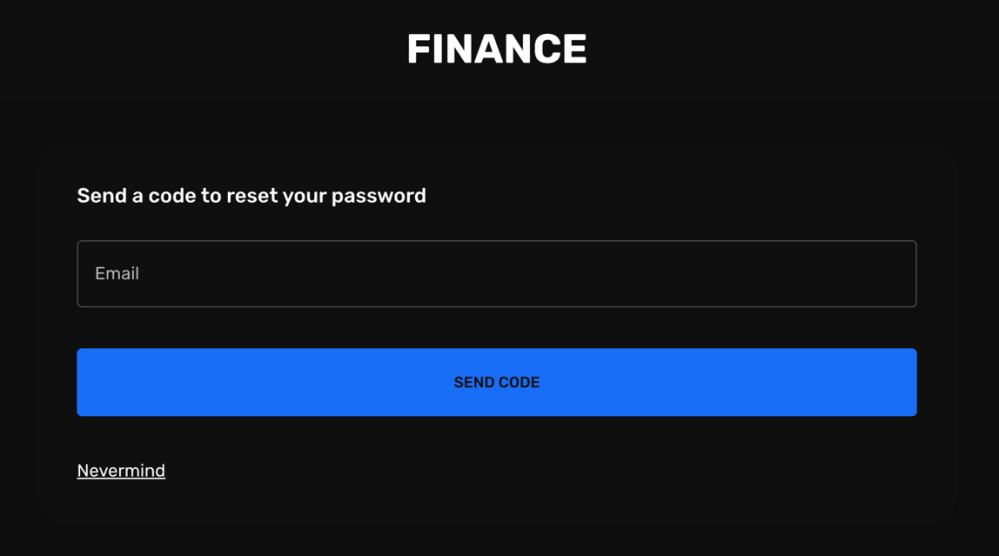

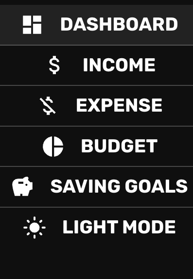
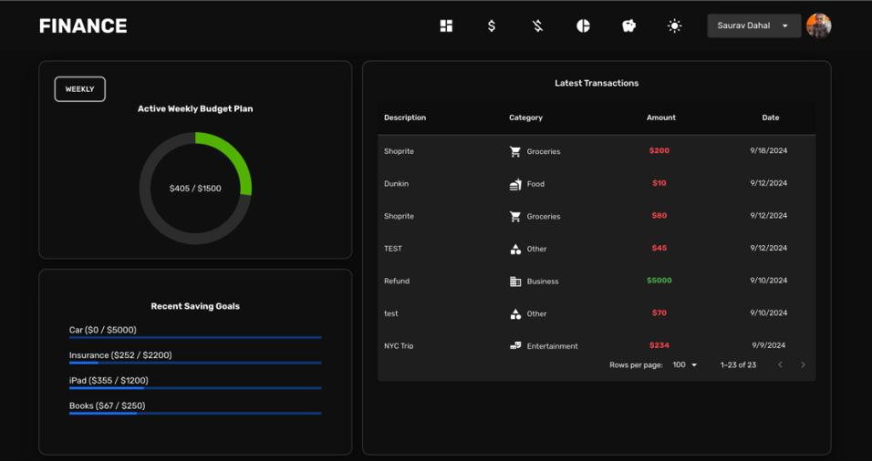
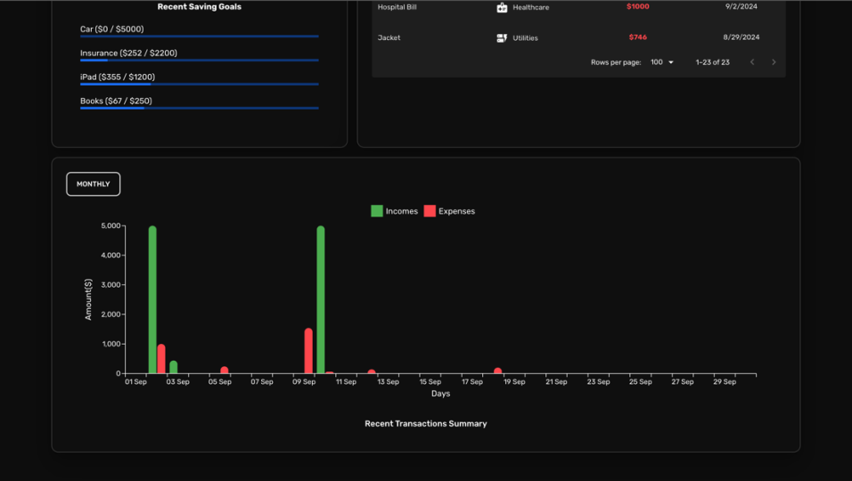
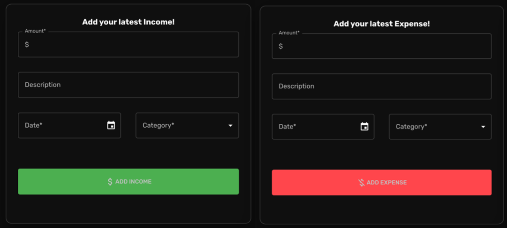
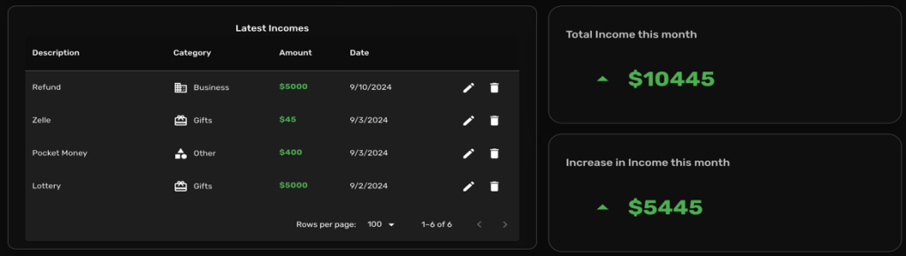
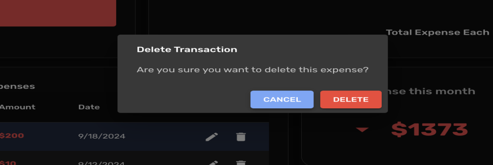
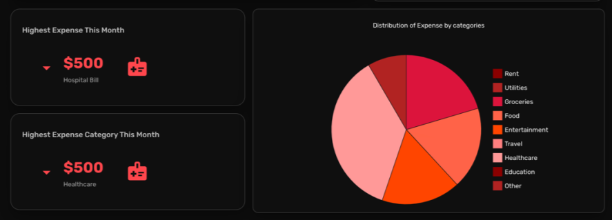
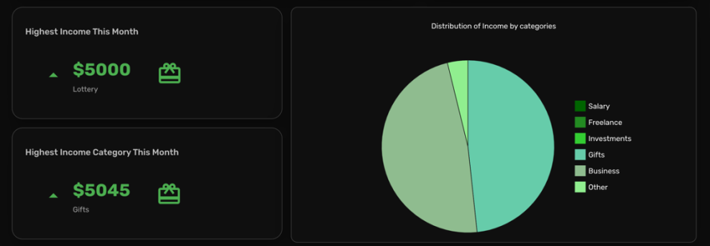
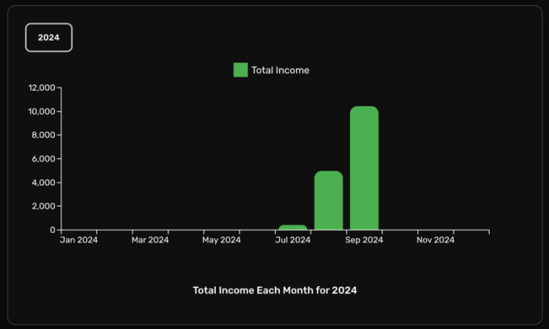
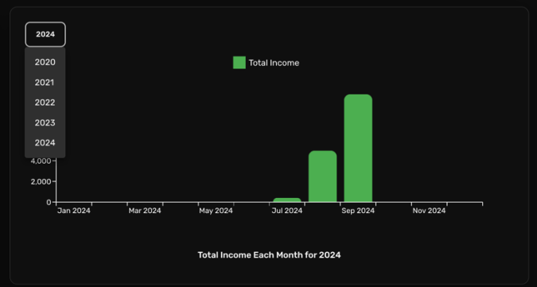
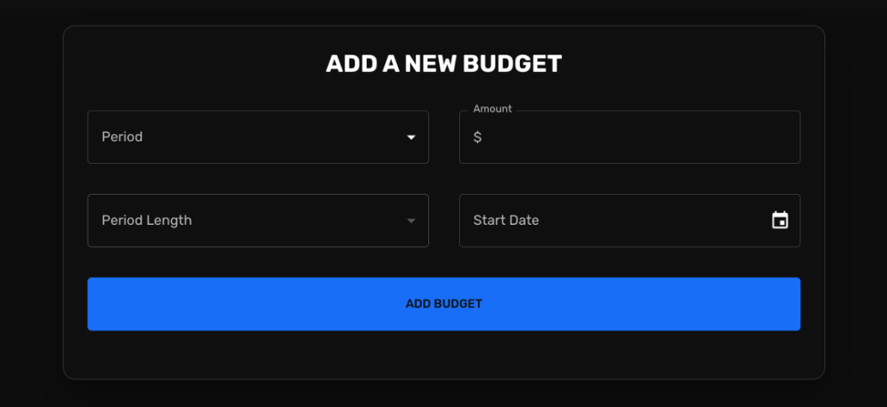
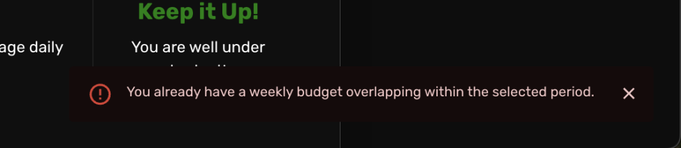
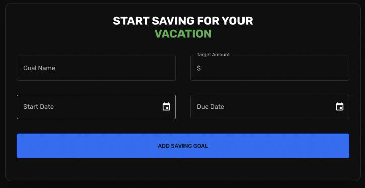
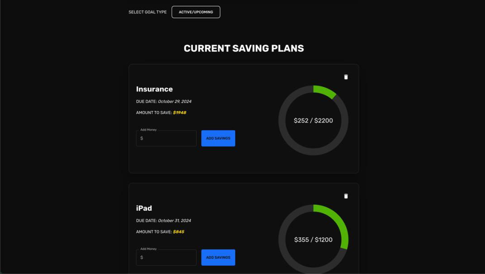
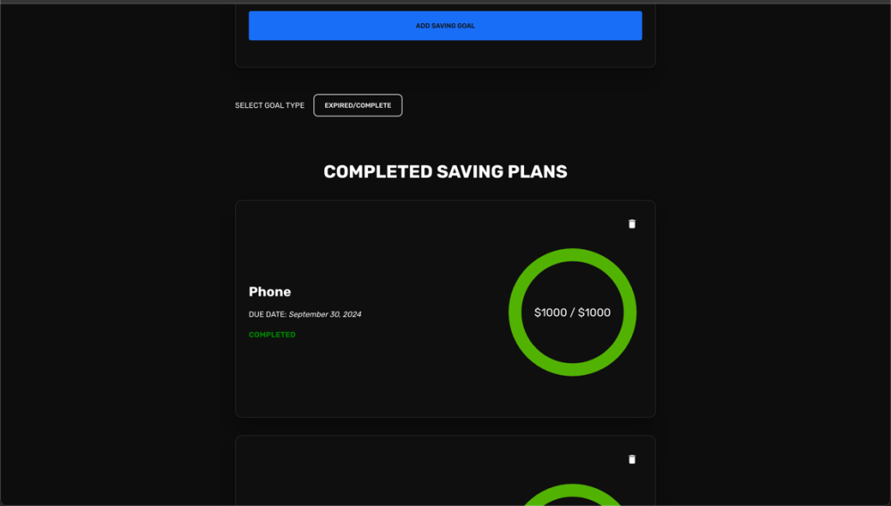
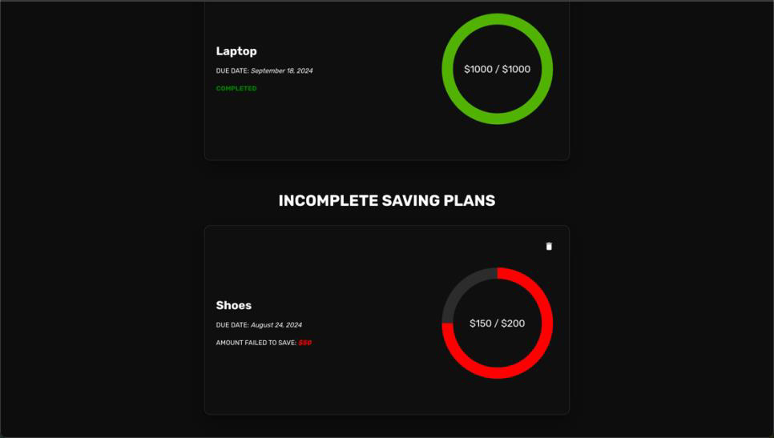

---
